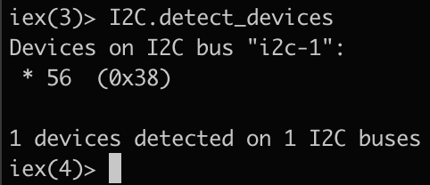
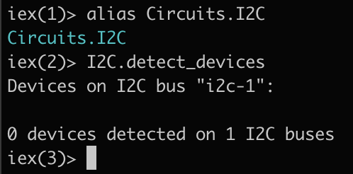

# Writing code

## Testing

It is common to want to verify that you have a working connection with the sensor. The Elixir [Circuits](https://elixir-circuits.github.io/) library is a handy abstraction for many common lower level communication protocols including [I2C](https://github.com/elixir-circuits/circuits_i2c) which is the protocol of choice for our AHT20 sensor. The `Circuits.I2C` library should already be included as a dependency so we can begin by probing the available devices:

```elixir
alias Circuits.I2C
I2C.detect_devices()
```

If you have correctly wired the sensor, you should see an output that shows a connected device and the device address:



If you have incorrectly wired the sensor, you will see an output that lists no devices detected:



With the detected device address you can attempt various commands that we will later use to command and read data from the sensor:

```elixir
{:ok, ref} = I2C.open("i2c-1")
I2C.write(ref, 0x38, <<0x01>>)
I2C.read(ref, 0x38, 1)
```

After succesfully connecting and communicating with the sensor, it is time to [review the datasheet](datasheet.md) to understand how we can have meaningful communication.

## Reading data

After reviewing the datasheet you should be ready to start implementing reading the sensor in code:

```elixir
I2C.write(ref, 0x38, <<0xBE>>)
I2C.write(ref, 0x38, <<0xAC, 0x33, 0x00>>)
{:ok, <<status, humidity::size(20), temperature::size(20), checksum>>} = I2C.read(ref, 0x38, 7)
```

Try to implement your sensor reading code as a module. After writing your new module, follow the process for building and burning a new firmware image and try to read the sensor data with your new module. You can [look here](../../lib/retreat_hack/temp_hum_sensor.ex) for an example if you are stuck.

Once you are succesfully sending commands and reading data from the sensor, please return to [the README](../../README.md) and follow the instructions to proceed to step 3.
