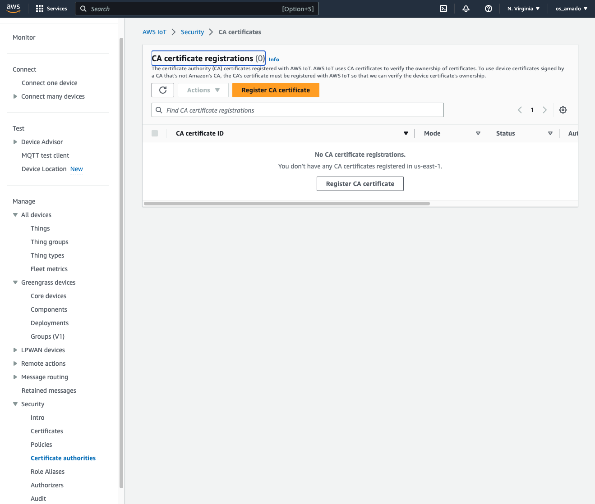
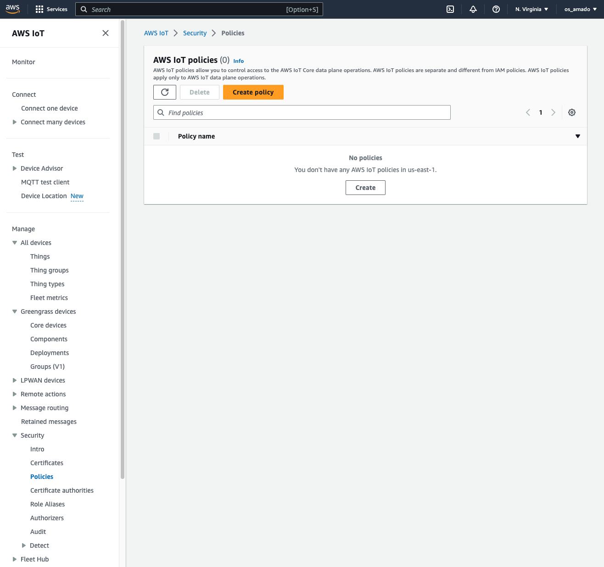
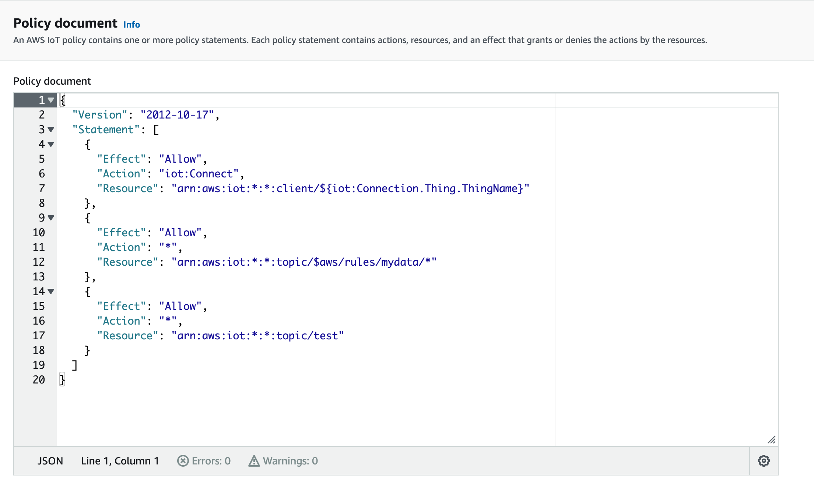
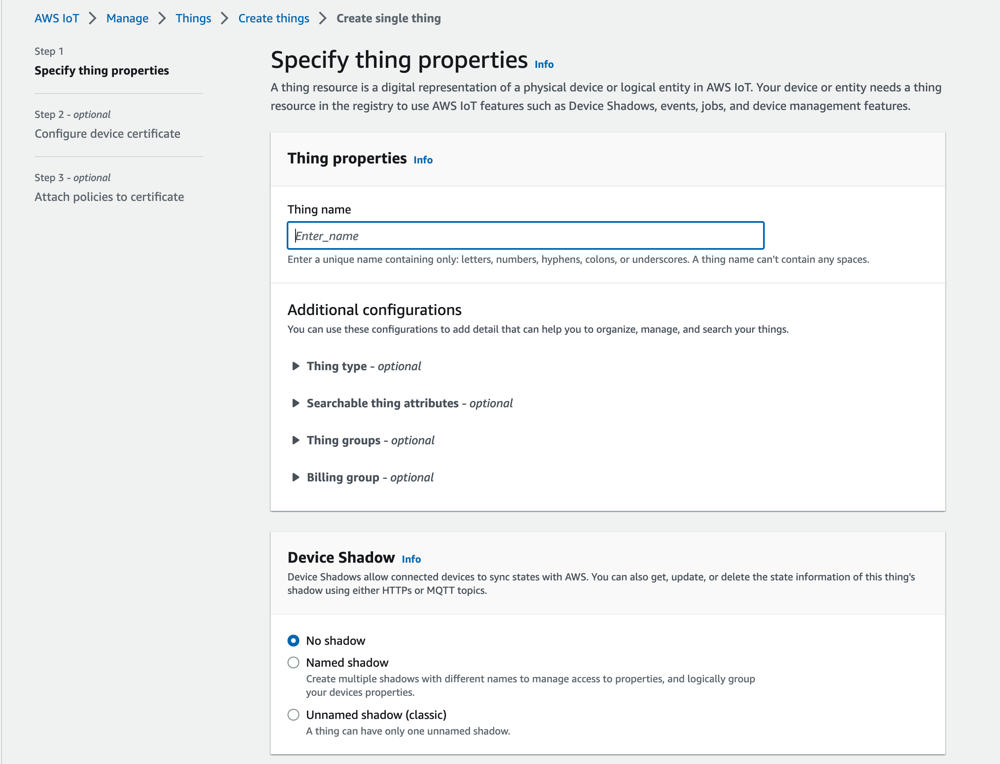
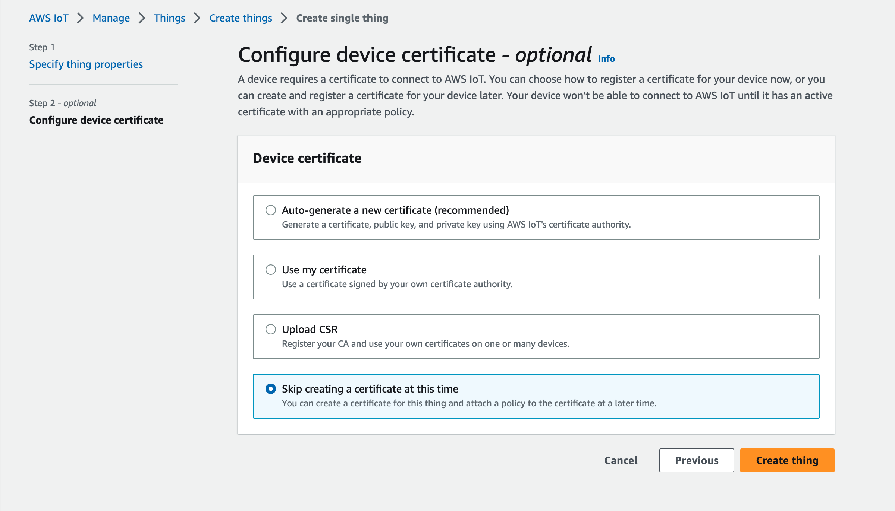
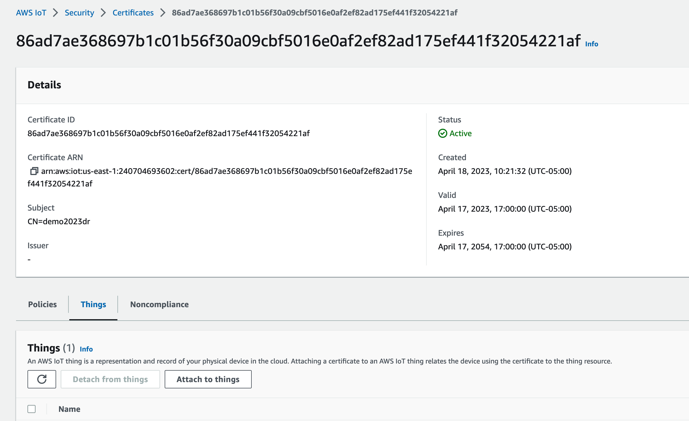

## How to create an AWS user and roles

Create or use an account https://aws.amazon.com/free/

# How to get certs into AWS IoT

- Include policy with topic(s) for [basic ingest](https://docs.aws.amazon.com/iot/latest/developerguide/iot-basic-ingest.html)
- Include creating an IoT thing
- Show options for AWS console and CLI?
- Extra: Setup JITP and custom self signed CA

# Configure environment for building firmware with necessary AWS variable like the MQTT endpoint

https://very-development.signin.aws.amazon.com/console

Upload CA certificate

https://docs.aws.amazon.com/iot/latest/developerguide/create-CA-verification-cert.html?icmpid=docs_iot_console_secure_ca_reg

Then you need to create a policy.

You can use a template

Upload cert

Attach cert to policy

Create thing name

Then attach the thing name to the cert

Extra: create rule
