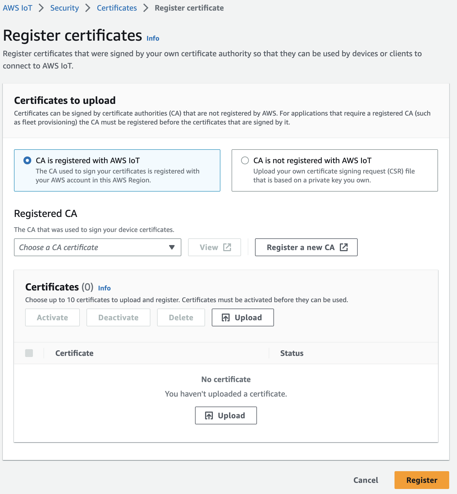
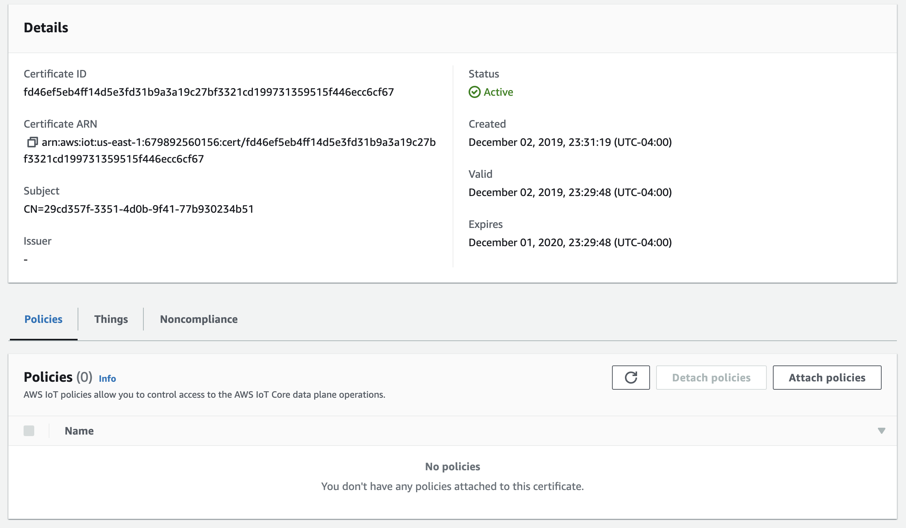

# AWS

## Access to AWS

You should have credentials to access the very development AWS account. If you need access, please request it in the #retreat_2023_iot_hack_project slack channel.

## How to get certs into AWS IoT

First we will need to upload our certifiate authority. This will require a verification step. [Follow the AWS instructions](https://docs.aws.amazon.com/iot/latest/developerguide/create-CA-verification-cert.html?icmpid=docs_iot_console_secure_ca_reg).


After the CA, you will need a policy to define which devices can connect to AWS IoT and which [MQTT](https://en.wikipedia.org/wiki/MQTT) topics we will allow communication on. [Basic ingest topics](https://docs.aws.amazon.com/iot/latest/developerguide/iot-basic-ingest.html) are often a good choice for cost related reasons but any topic may be added including [AWS IoT Shadow](https://docs.aws.amazon.com/iot/latest/developerguide/iot-device-shadows.html) topics. Take note of which MQTT topics you have registered, we will need to use them to publish messages to the cloud from our rpi0 devices.


Example policy JSON:

```json
{
  "Version": "2012-10-17",
  "Statement": [
    {
      "Effect": "Allow",
      "Action": "iot:Connect",
      "Resource": "arn:aws:iot:*:*:client/${iot:Connection.Thing.ThingName}"
    },
    {
      "Effect": "Allow",
      "Action": ["iot:Publish", "iot:Receive"],
      "Resource": "arn:aws:iot:*:*:topic/$aws/rules/mydata/*"
    },
    {
      "Effect": "Allow",
      "Action": ["iot:Publish", "iot:Receive"],
      "Resource": "arn:aws:iot:*:*:topic/test"
    },
    {
      "Effect": "Allow",
      "Action": "iot:Subscribe",
      "Resource": "arn:aws:iot:*:*:topicfilter/test"
    }
  ]
}
```

After creating your policy we will need to [register our certificate](https://docs.aws.amazon.com/iot/latest/developerguide/manual-cert-registration.html). Please follow the steps provided by AWS (linked above) to register the cert. Make sure to register with the certificate authority we added previously. After registering the cert we will need to attach the policy we created in the previous step.





Next you will need to create a thing (remember to use the thing name that matches the certificate you created previously). Do not attempt to associate a certificate during thing creation. After successfully creating the thing, you can associate it with your certificate.


## Efficiency

It may seem an overly complex and manually oriented process to register things in AWS IoT. The good news is that it is possible to simply upload the certificate authority and then define a just-in-time-provisioning policy for registering the certificate and creating the thing and associating the correct policy. Check [here](https://docs.aws.amazon.com/iot/latest/developerguide/jit-provisioning.html) for instructions.

    Extra: Add a provisioning policy to your authentication flow.

When AWS is configured, we are ready to move on to [configuring MQTT on our devices](mqtt_client.md).
