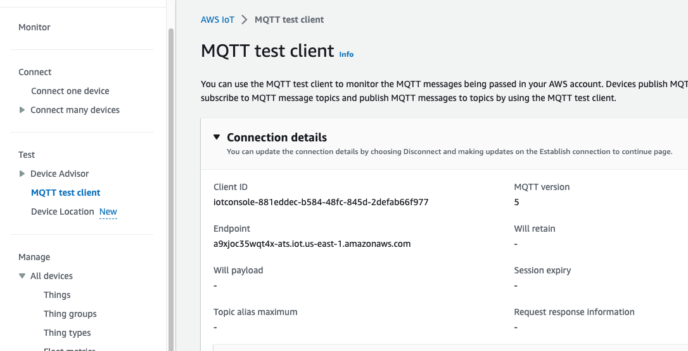
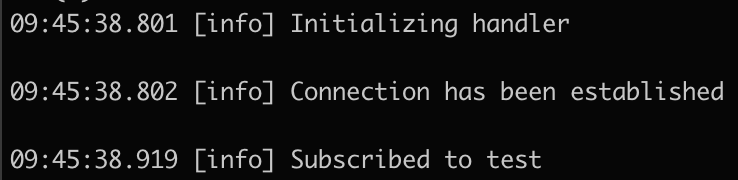

# Connect to AWS via MQTT

## MQTT

One of the most common forms of communication protocols for remote devices is [MQTT](https://mqtt.org/) a lightweight pub/sub transport that has been optimized for minimizing network bandwidth. It will be worth reviewing the documentation in order to become familiar with the details of the protocol but for our project we will simply be using the basic publish and subscribe features. We will let libraries handle the protocol details and our focus will be on configuration.

We have opted to pre-include [Tortoise311](https://github.com/smartrent/tortoise311) for this project. You may need to re-install dependencies to ensure it is ready to be used.

## Configuration

Take a look at the [tortoise311 documentation](https://hexdocs.pm/tortoise311/connecting_to_a_mqtt_broker.html) and try to determine what data will be needed for configuration. Each MQTT broker will have it's own configuration needs but the large cloud providers all have many things in common. Belowe are a few hints about places to look for how to successfully configure a connection with AWS, however this process can be troublesome and if you need help or a nudge in the right direction, we have included a full configuration example [here](../../lib/retreat_hack/cloud_comm/mqtt.ex).

- [Quick AWS IoT Guide](https://www.verytechnology.com/iot-insights/aws-iot-core-elixir-and-nerves-a-crash-course)
- The AWS MQTT endpoint can be found in AWS IoT Core settings or the CLI. And should be set via ENV var. You can see the expected var name in [the config](../../config/config.exs) line 31.
- [AWS CA cert documents](https://docs.aws.amazon.com/iot/latest/developerguide/server-authentication.html)
- [Github issue debugging](https://github.com/smartrent/jackalope/issues/28)



## Does It Work?

Fortunately it is easy test that our MQTT connection is working as expected. We'll run the code on our host computer so we don't need to do any extra work to configure Internet access.

```sh
iex -S mix
```

After booting the console, run the connection code. It may be a good idea to wrap the code in a GenServer so that we can more easily manage the process later on.

```elixir
RetreatHack.CloudComm.Mqtt.start_link([])
```

If everything worked as expected, you should see something like this:



Now that we are connected we can confirm by sending a message over the connection and if we are subscribed to the topic that we send on, we should see our message echoed back to us:

```elixir
RetreatHack.CloudComm.Mqtt.publish_message(:placeholder, "Test")
```

Feel free to add more configuration and test out more of the capabilities of Tortoise311 and the MQTT protocol. When you are satisfied and are ready to move on, we will look at [Internet configuration on hardware](connectivity.md).
